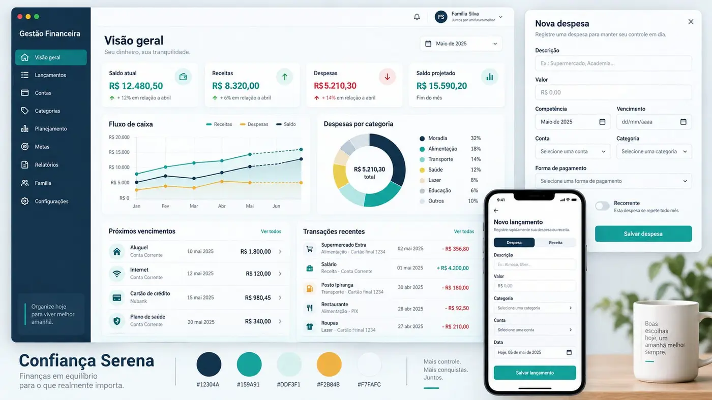

# Diretrizes visuais — Confiança Serena

**Status:** direção visual aprovada em 20/09/2026.

Esta é a referência visual oficial inicial da plataforma Gestão Financeira
Familiar. Ela deve orientar a implementação do dashboard, dos cadastros e dos
componentes compartilhados.



O mockup representa a intenção visual e a hierarquia das informações. Ele não é
uma especificação pixel a pixel, e os valores, textos ilustrativos e objetos ao
redor das telas não fazem parte do produto.

## Objetivo visual

A interface deve transmitir:

- confiança e segurança para lidar com informações financeiras;
- tranquilidade, sem aparência fria de aplicativo bancário;
- clareza para registrar e conferir dados rapidamente;
- maturidade suficiente para uma futura comercialização como SaaS;
- boa leitura em computador e celular.

O resultado deve ser moderno, limpo e sóbrio. Evitar excesso de cores,
gradientes, sombras, ilustrações decorativas ou indicadores sem utilidade.

## Paleta principal

- **Azul-marinho — `#12304A`:** navegação lateral, títulos, textos de maior
  hierarquia e séries de saldo.
- **Verde-petróleo — `#159A91`:** identidade da marca, gráficos, ícones,
  destaques e estados positivos.
- **Verde-petróleo escuro — `#117F78`:** botões primários e áreas que recebem
  texto branco. É a variação de contraste do verde principal.
- **Azul-aqua claro — `#DDF3F1`:** fundos de seleção, badges suaves, ícones e
  destaques discretos.
- **Âmbar — `#F2B84B`:** avisos, compromissos próximos e pontos de atenção. Não
  usar como cor de texto sobre fundo branco.
- **Branco frio — `#F7FAFC`:** fundo geral da aplicação.
- **Branco — `#FFFFFF`:** cards, formulários, modais e superfícies elevadas.

Cores semânticas complementares:

- **Vermelho — `#DC3545`:** valores negativos, vencimentos e erros. Usar com
  moderação, sem transformar todo card de despesa em vermelho.
- **Texto secundário — `#60758A`:** descrições, legendas e informações de apoio.
- **Borda — `#DCE6EC`:** divisão entre superfícies e campos.
- **Fundo neutro — `#EEF4F7`:** áreas desabilitadas, skeletons e blocos
  secundários.

## Tokens sugeridos

Na implementação com Tailwind e componentes shadcn, as cores devem entrar por
tokens semânticos em `resources/css/app.css`, evitando cores repetidas diretamente
nos componentes.

```css
--background: #f7fafc;
--foreground: #12304a;
--card: #ffffff;
--card-foreground: #12304a;
--primary: #117f78;
--primary-foreground: #ffffff;
--secondary: #ddf3f1;
--secondary-foreground: #12304a;
--muted: #eef4f7;
--muted-foreground: #60758a;
--accent: #ddf3f1;
--accent-foreground: #12304a;
--destructive: #dc3545;
--border: #dce6ec;
--input: #dce6ec;
--ring: #159a91;
--sidebar: #12304a;
--sidebar-foreground: #f7fafc;
--sidebar-primary: #117f78;
--sidebar-primary-foreground: #ffffff;
--chart-1: #159a91;
--chart-2: #f2b84b;
--chart-3: #12304a;
--chart-4: #75c7c0;
--chart-5: #8395a7;
```

Os valores podem ser convertidos para OKLCH durante a implementação, desde que
a aparência e o contraste sejam preservados. O verde `#159A91` não deve receber
texto branco pequeno; para esse caso, usar `#117F78`.

## Tipografia e iconografia

- Manter **Instrument Sans**, já configurada no projeto.
- Títulos de página: peso 600 ou 700, com leitura clara e sem tamanho exagerado.
- Valores financeiros principais: peso 600 ou 700 e números tabulares quando
  disponíveis.
- Textos auxiliares: menores, mas com contraste suficiente.
- Usar os ícones do **Lucide React**, com o mesmo peso visual em toda a aplicação.
- Não depender apenas da cor para comunicar estado; combinar cor, ícone e texto.

## Estrutura geral

- Aplicar uma grade base de 8 px.
- Usar conteúdo fluido com espaçamento lateral de 24 px no desktop e 16 px no
  celular.
- Manter a navegação lateral azul-marinho no desktop, com aproximadamente 240 a
  256 px quando expandida e versão recolhida apenas com ícones.
- Usar cabeçalho discreto para contexto do workspace, período, notificações e
  perfil do usuário.
- Cards devem ter fundo branco, borda leve, raio aproximado de 12 px e sombra
  muito sutil.
- Espaço entre cards: 16 px; entre grandes seções: 24 px.
- Modais e painéis devem preservar contexto e ter ações principais claramente
  identificadas.

## Dashboard

O dashboard deve priorizar decisão e conferência rápida, sem excesso de gráficos.

Ordem sugerida:

1. título **Visão geral**, seletor de período e identificação do workspace;
2. quatro cards principais: **Saldo atual**, **Receitas**, **Despesas** e
   **Saldo projetado**;
3. gráfico de **Fluxo de caixa** e resumo de **Despesas por categoria**;
4. listas de **Próximos vencimentos** e **Transações recentes**;
5. pendências e exceções financeiras quando esses recursos estiverem disponíveis.

No desktop, os quatro indicadores ficam na mesma linha quando houver espaço. Em
larguras intermediárias passam para duas colunas e, no celular, para uma coluna
ou carrossel acessível. Gráficos nunca devem substituir valores e descrições
textuais importantes.

Uso de cores nos dados:

- receitas e estados positivos em verde-petróleo;
- despesas efetivas ou valores negativos em vermelho, apenas nos números e
  indicadores relevantes;
- compromissos próximos em âmbar;
- saldo e informações neutras em azul-marinho;
- projeções com traço pontilhado ou preenchimento suave, além da cor.

## Cadastros e lançamentos

Formulários devem ser rápidos, previsíveis e organizados pela ordem mental do
usuário.

- Labels sempre visíveis acima dos campos.
- Campos relacionados podem ocupar duas colunas no desktop e uma no celular.
- Mensagens de ajuda devem aparecer apenas quando evitarem um erro financeiro.
- A ação principal fica à direita no desktop e ocupa toda a largura no celular.
- A ação de cancelar deve ter menor destaque e nunca competir com salvar.
- Erros devem aparecer próximos ao campo correspondente.

Para uma **nova despesa**, a organização visual de referência é:

1. descrição e valor;
2. competência e vencimento;
3. conta e categoria;
4. forma de pagamento;
5. opções de recorrência ou parcelamento;
6. ação **Salvar despesa**.

Ao cadastrar despesa a prazo ou recorrente, a forma de pagamento precisa ficar
visível. Quando aplicável, exibir favorecido e instrução de pagamento, como chave
Pix ou identificação do boleto. Esses dados complementam o lançamento, sem
alterar as regras financeiras definidas no documento-base.

Cadastros rápidos podem usar um painel lateral de 440 a 480 px no desktop. Fluxos
mais complexos devem usar página própria. No celular, o painel ocupa a tela
inteira para evitar campos apertados.

## Responsividade

- Desktop: navegação lateral persistente e conteúdo em grade.
- Tablet: navegação recolhível e cards em duas colunas.
- Celular: conteúdo em uma coluna, áreas de toque com pelo menos 44 px e ações
  principais fáceis de alcançar.
- A navegação móvel pode usar uma barra inferior com as funções mais frequentes;
  itens menos utilizados ficam em **Mais**.
- Tabelas financeiras devem se adaptar por priorização de colunas ou cards, sem
  exigir rolagem horizontal para operações comuns.

## Tema escuro

O tema claro do mockup é a referência principal, mas o suporte a tema escuro já
existente deve ser preservado. A versão escura deve usar tokens próprios e
contraste validado; não deve ser criada apenas invertendo automaticamente as
cores do tema claro.

## Critérios para a implementação

- Centralizar a identidade nos tokens do tema antes de ajustar telas isoladas.
- Reutilizar componentes compartilhados para cards, valores, estados e campos.
- Validar contraste, foco por teclado e legibilidade dos valores financeiros.
- Manter a hierarquia do mockup sem copiar dados fictícios ou decoração externa.
- Não introduzir biblioteca visual nova sem necessidade; utilizar a stack atual.
- Aplicar a identidade progressivamente, começando pelo shell, dashboard e
  formulários principais.
